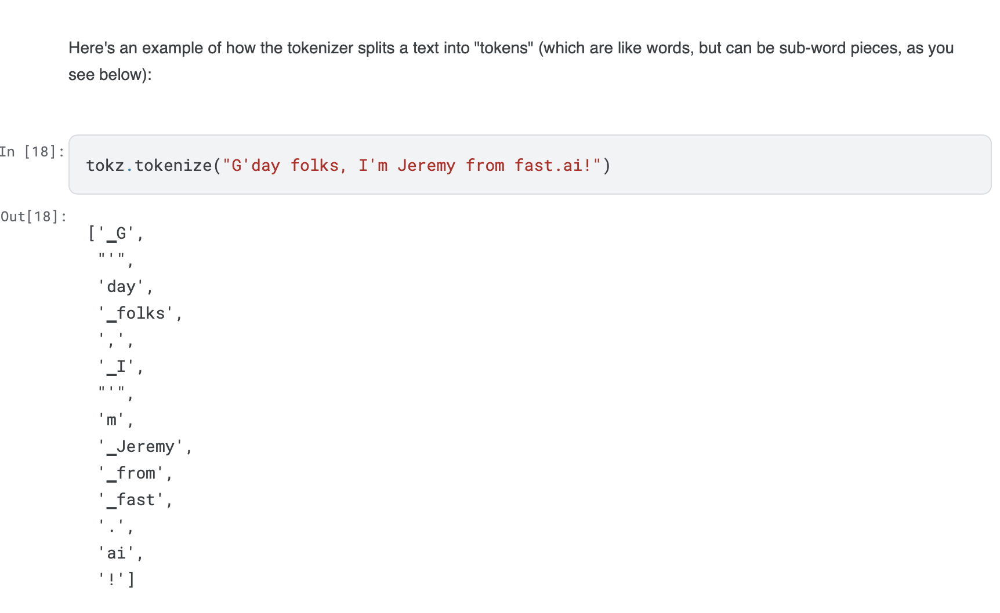

# Lecture 4: Natural Language (NLP)

https://course.fast.ai/Lessons/lesson4.html

Based on Ch. 10 from the book:

https://colab.research.google.com/github/fastai/fastbook/blob/master/10_nlp.ipynb#scrollTo=iDkP2jcF1uLN

Fast.ai created ULMfit to generate language models with RNNs. Goal was to predict every single next word in a corpus of text using RNNs.

Around same time, Transformers rolled out with similar goal utilizing a new "Transformer" architecture instead of RNNs.

This lecture will utilizing the Transformers package from HuggingFace instead of Fast.ai library.

Tokenization - Split words/sub-words int tokens, numbers that represent pieces of words. Used to train a language model since neural nets work with numbers and not strings.

Tokenization: Split each text up into words (or actually, as we'll see, into tokens)

Numericalization: Convert each word (or token) into a number.

We used the built in tokenizer with the imported model to ensure we have the same vocabulary as the model. With this tokenizer, can pass string into it and see it converted to tokens. Notice that the tokens are not explicitly distinct words. Now, we can convert these tokens to numbers (Numericaliztion).

The numbers used are the position of each token in the tokenized vocabulary. That's it, just the index of the token.

Most important idea in ML is having separate distint training, validation, and testing datasets.

HuggingFace Transformers: https://huggingface.co/docs/transformers/index

Transformers library meant to provide access to pre-trained Transformers based models. The library is not meant to build Neural Nets from scratch. It is compatible with PyTorch, TensorFlow, and Jax to build upon the pre-trained models. Also provides methods for deploying pre-trained/fine-tuned models to production for infernece.

Fast.ai tokenizer inserts special characters depending on the text. They are added to make it easier for a model to recognize the important parts of a sentenct.

**In a sense, we are translating the default English language into a simplified tokenized version of the language. A language that is designed to be easy for a model to learn.**

Here are some of the main special tokens you'll see:

- `xxbos`:: Indicates the beginning of a text (here, a review)
- `xxmaj`:: Indicates the next word begins with a capital (since we lowercased everything)
- `xxunk`:: Indicates the word is unknown

Subword tokenization is useful when working with languages that do no use spaces (Chinese, Japanese). In subword tokenization, tokens are created from the most commonly occuring substrings of characters. 

his proceeds in two steps:

1. Analyze a corpus of documents to find the most commonly occurring groups of letters. These become the vocab.
2. Tokenize the corpus using this vocab of *subword units*.

You can pick the size of vocab you'd like to create. If we use a smaller vocab then each token will represent fewer characters, and it will take more tokens to represent a senetence. A larger vocab means fewer tokens per sentence , which means faster training, less memory, and less state for the model to remember; but on the downside, it means larger embedding matrices, which require more data to learn.

### Questions

1. What is "self-supervised learning"?

Self-supervised learning is a learning methodlogy that rather than learning by adjusting weights based on the difference between a model's prediction and the correct answer (supervised learning) learns without labels. A lot of text is fed into the model and the model is instead trained on labels that are embedded within the text itself, rather than requiring external labels. Training a model to predict the next word is a good example.

2. What is a "language model"?

A language model is a model that has been trained over a corpus of text. Normally, the language model has been trained to predict the next word given a sequence of words. However, this can be changed through fine-tuning the model's layer layers.

3. Why is a language model considered self-supervised?

Because during training, target labels are not provided. Instead, the model uses the context of the training text.

4. What are self-supervised models usually used for?

Usually used for language models, but can also be used for Computer Vision.

5. Why do we fine-tune language models?

We fine-tune language models for the same reason we fine-tune any other ML model. A neural nets later layers learn very specific tasks and may not be useful for all tasks. However, the model's base layers generally learn very generic features that can be applied to all different types of tasks within the same relative domain. By fine-tuning, you can take the base layers of a model and re-train the classification layers/heads for your specific task. This is faster and easier to do than building/training an entire model from scratch.

6. What are the three steps to create a state-of-the-art text classifier?

Tokenization, 

7. How do the 50,000 unlabeled movie reviews help us create a better text classifier for the IMDb dataset?

We can take the original model trained on WikiPedia and fine tune it over the IMDB movie review dataset. Since our task at hand is to classify movie review sentiments, this can be very helpful. Although the original model will be able to understand english after training on the wikipedia dataset, movie reviews generally follow a very different format, tenor, and language than what is in wikipedia. By fine tuning on the movie review dataset, our model can better learn how to interpret the language used in that particular dataset. This will be extremely helpful when applying our model to classify movie reviews later on.

8. What are the three steps to prepare your data for a language model?

9. What is "tokenization"? Why do we need it?

Tokenization is the process of converting strings of text to numerical values that our model can understand. Tokenization is required because neural nets cannot understand text, they understand numbers. So, tokenization involves breaking works into sub-words that make up a corpus of text. This collection of sub-words are called a "vocabulary" because they represent all of the most common sub-words in our text. To conver these sub-words to numbers we can simply refer to each sub-word by its index value in the vocab collection. These values are what we eventually pass into our model and every string of text that the model is trained on will be converted to its tokenized format before the being passed on to the model.

10. Name three different approaches to tokenization.

Word, sub-word, and character.

11. What is `xxbos`?

Indicates the beginning of a text.

12. List four rules that fastai applies to text during tokenization.

13. Why are repeated characters replaced with a token showing the number of repetitions and the character that's repeated?

14. What is "numericalization"?

Converting the tokens to numerical representations. Done so using the token's index in the vocab collection.

15. Why might there be words that are replaced with the "unknown word" token?

With a large vocab, sometimes we require a token to occur a minimum number of times in order to be included in the tokenized vocab. This is done to save on memory required to store the vocab. Any token that does not occur at least the minimum number of times is replaced with the "unknown word" token.

16. With a batch size of 64, the first row of the tensor representing the first batch contains the first 64 tokens for the dataset. What does the second row of that tensor contain? What does the first row of the second batch contain? (Careful—students often get this one wrong! Be sure to check your answer on the book's website.)

17. Why do we need padding for text classification? Why don't we need it for language modeling?

18. What does an embedding matrix for NLP contain? What is its shape?

The embedding matrix contains all of the tokenized vocab and special tokens.

19. What is "perplexity"?

It is the exponential of the loss (i.e., torch.exp(cross_entropy))

20. Why do we have to pass the vocabulary of the language model to the classifier data block?

The reason we pass the vocab is to make sure we use the same correspondence of token to index. Otherwise, the embeddings we learned in our fine-tuned model won't make any sense to the classifier model.

21. What is "gradual unfreezing"?

The process of unfreezing a few layers of a model at a time, as opposed to unfreezing all layers at once. NLP classifiers work better with gradual unfreezing.

22. Why is text generation always likely to be ahead of automatic identification of machine-generated texts?

